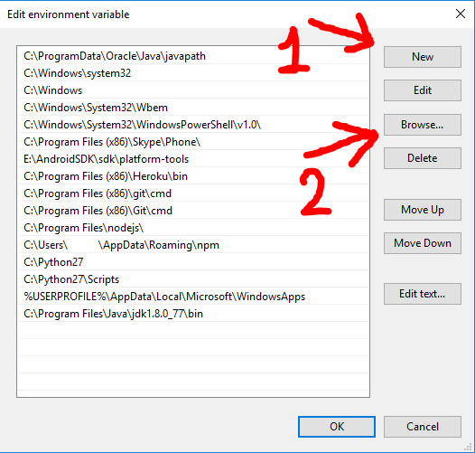

# README

## install

1. Setup VLC player (linux)
   1. Install VLC
      * Ubuntu
         ```bash
         sudo apt install vlc ffmpeg
         ```
      * Sles/OpenSuse
         ```bash
         sudo zypper in vlc
         ```

2. Setup VLC player (windows)
   1. Install [VLC](https://www.videolan.org/vlc/download-windows.html)
   2. Open system properties

      
   3. Click the Environment Variables

      
   4. Under the “System Variables” section (the lower half), find the row with “Path” in the first column, and click edit.

      
   5. Under the “System Variables” section (the lower half), find the row with “Path” in the first column, and click edit.

       
3. Install python3 requirements
   ```bash
   pip3 install -r requirements.txt
   ```
## Configuration

You can configure the program in the file config.yaml

## Run

	```bash
	sudo python3 main.py
	```
