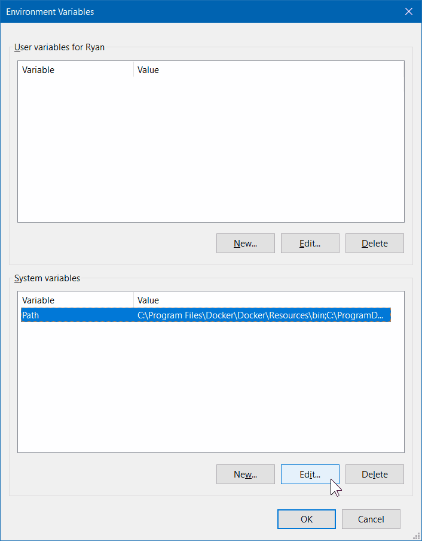

# README

## install

1. Setup VLC player (linux)
   * Ubuntu
      ```bash
      sudo apt install vlc ffmpeg
      ```
   * Sles/OpenSuse
      ```bash
      sudo zypper in vlc
      ```

   Setup VLC player (windows)
      1. 
        
      2. 
        
      3. 
        
      4.   
        
2. Install python3 requirements
      ```bash
      pip3 install -r requirements.txt
      ```
## Configuration

You can configure the program in the file config.yaml

## Run

   ```bash
   sudo python3 main.py
   ```
